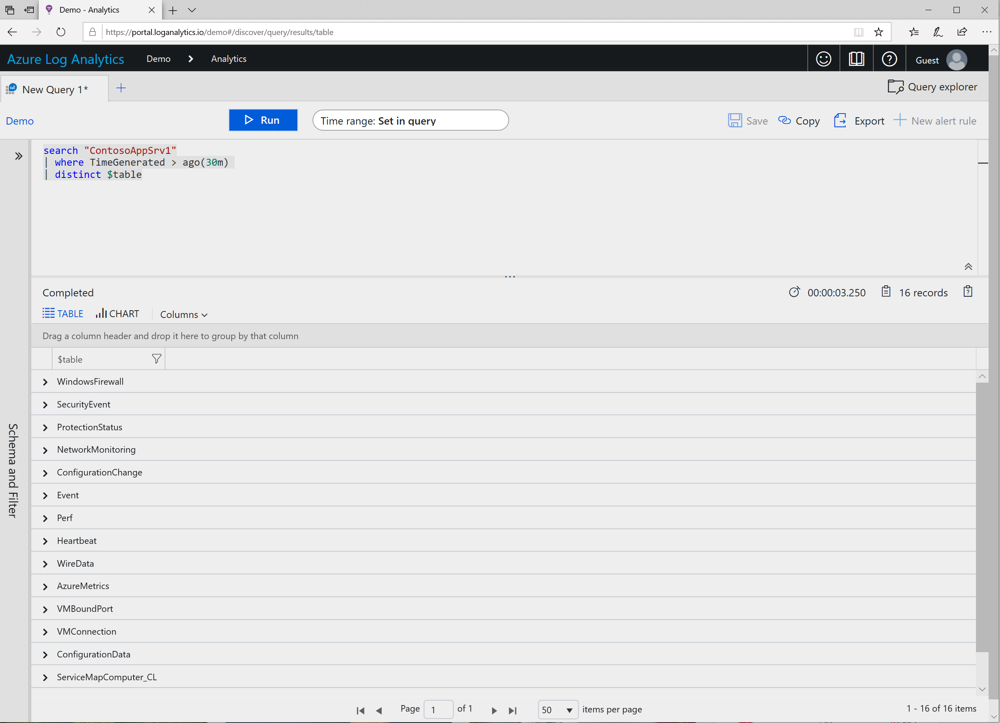

## Answers
[Quick Link](https://portal.loganalytics.io/Demo?q=H4sIAAAAAAAAAytOTSxKzlBQcs7PK8kvzncsKAguKjNU4uWqUSjPSC1KVQjJzE11T81LLUosSU1RsFNITM%2FXMDbI1VQAKUnJLC7JzEsuUVApSUzKSeUCAI9mZwROAAAA)
~~~
search "ContosoAppSrv1"
| where TimeGenerated > ago(30m) 
| distinct $table
~~~
