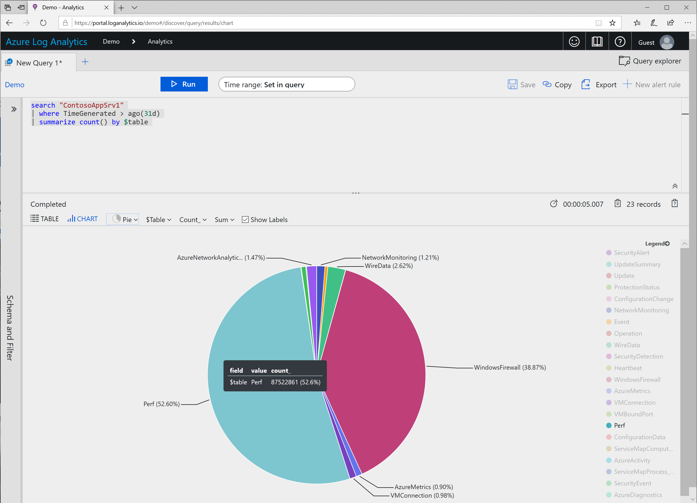

## Answers

[Quick Link](https://portal.loganalytics.io/Demo?q=H4sIAAAAAAAAAytOTSxKzlBQcs7PK8kvzncsKAguKjNUUuDlqlEoz0gtSlUIycxNdU%2FNSy1KLElNUbBTSEzP1zA2TNEEKykuzc1NLMqsSlVIzi%2FNK9HQVEiqVFApSUzKSQXKAwB%2BdBd1XQAAAA%3D%3D)
~~~
search "ContosoAppSrv1" 
| where TimeGenerated > ago(31d) 
| summarize count() by $table 
~~~
