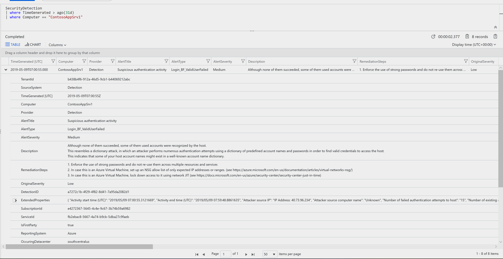
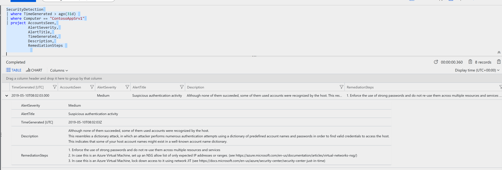

Getting started you'll need to look through the raw data you've queried; You've been tasked to format this into a proper fomart for presentation purposes and future queries.You'll need to start looking over the data within each event.
Based on the previous query : 
~~~~
SecurityDetection
| where TimeGenerated > ago(31d) 
| where Computer == "ContosoAppSrv1"
~~~~

You should see the following data:

In order to format the data you'll need to use the ["Project" operator](https://docs.microsoft.com/en-us/azure/kusto/query/projectoperator)

Examples:

~~~~
SecurityDetection
| where TimeGenerated > ago(31d) 
| where Computer == "ContosoAppSrv1"
| project AccountsSeen,
          AlertSeverity,
          AlertTitle,
          TimeGenerated,
          Description,
          RemediationSteps         

~~~~

