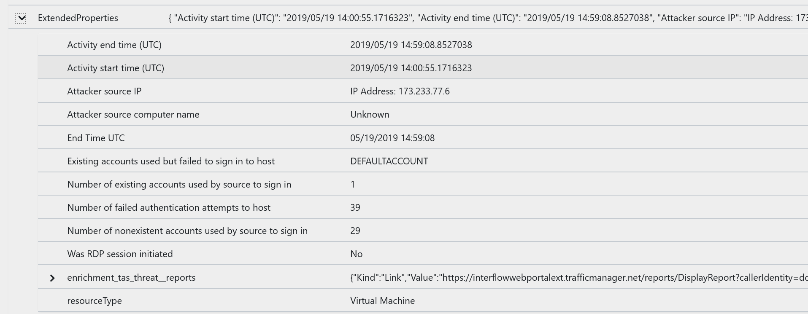
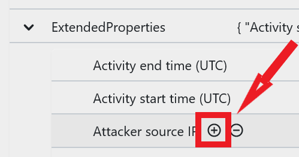

You've found the data you're looking for, it's in JSON format within the collected event called "ExtendedProperties"

You can see the attacker IP Address information in there, User account that was attacked, When it started and stopped.

You'll need to parse the JSON into a column

Clicking on the (+) will give you the best hint

