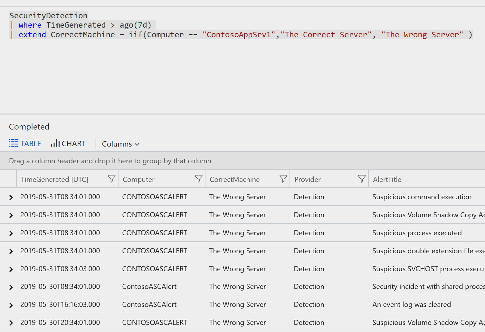

Stuck? click on AttackedUser for the last hint answer

[AttackedUser](https://portal.loganalytics.io/Demo?q=H4sIAAAAAAAAA0WOTWsCQRBE7wv7H5o9KQRBPG9gMeI1YHISkclMZ7c1dg%2FdPX6APz4rAVOnd3hV1AZjUfLbGzpGJ%2BG6usNlQEX4oBOukVGDY4JXCL1MFvM0hX9lKadcHBXaFpqlsItJl%2FNGz%2FPmYWWVwzj79F7qCp7p3EM8Yvo01C5GKextDmq4P5jwZHV15ITpXSWjOqFNZ9tmdSVz4h7CX8Og2Pjuqzh8B%2FoZ0QWMegbiBw5i3uzq6hdPgyTy6AAAAA%3D%3D)

Hmm.. i'm suppose to report if the account was compermised or not, looks like the inability to get a sucessful RDP session is good enough, i'll need to build out an [iif funtion](https://docs.microsoft.com/en-us/azure/kusto/query/iiffunction) to show that information within the report.

Example:

~~~
SecurityDetection
| where TimeGenerated > ago(7d) 
| extend CorrectMachine = iif(Computer == "ContosoAppSrv1","The Correct Server", "The Wrong Server" )
~~~

